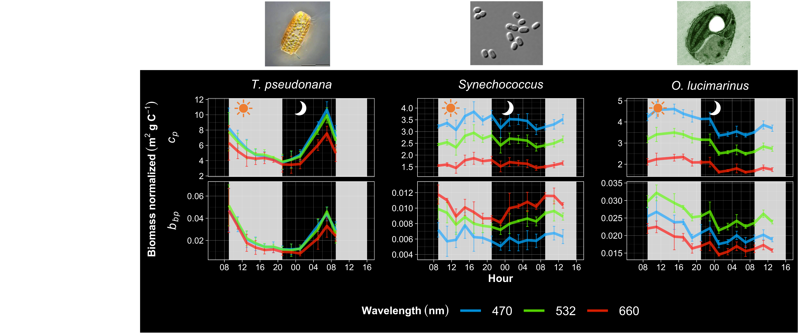

# Diel Phytoplankton Bio-optical Properties

Satellite remote sensing of marine phytoplankton is critical for estimating ocean productivity and carbon cycling. Characterizing day-night cycles in phytoplankton optical properties is essential for improving the translation of remote sensing data into biogeochemical rates and stocks. In this NASA-funded project, we evaluated diel changes in the bio-optical properties for three ecologically relevant phytoplankton species to refine ocean color algorithms and describe them in this [paper](https://doi.org/10.1002/lno.12493).
\
\
```{r, echo=FALSE, fig.cap= "Diel cycles backscattering and attenuation at 3 wavelengths for: the nano-eukaryotic diatom *Thalassiosira pseudonana*, the cyanobacterium *Synechococcus* (WH8102), and the pico-eukaryotic chlorophyte *Ostreococcus lucimarinus*. These optical properties were related to cell concentration, proxies for cell size, and intracellular pigment composition and concentration. We observed species-specific differences in the diel variability of these optical properties, suggesting that deriving biological products (like carbon) from bio-optical (incl. remote sensing data) must consider both time of day and community composition.", out.width = '100%', fig.align='center'}

```