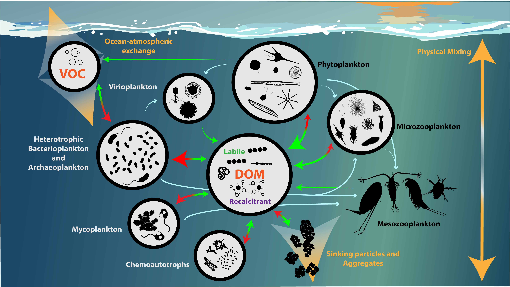

# My research

The oceans teem with marine microbes that move at the mercy of currents. These microbes are largely invisible to the naked eye, but have huge impacts on how food webs function and how elements are cycled throughout the planet. My research is dedicated to studying these amazing microbes and the processes they influence.
\
\
<center>{ width=75% }</center>
\
\
\
<center><h4 style="font-size: 14px; color: #AEC96F"> Plankton from the Oregon Coast in July 2023, shot with the Curiosity Microscope. </h4></center>
\
CO~2~ entering the ocean from the atmosphere is fixed into organic carbon by phytoplankton in the surface ocean. The produced organic carbon fuels marine food webs, but a portion can also make its way or be exported deep into the ocean interior where it is separated from the atmosphere for centuries to millennia. This vertical export of organic carbon is a major mechanism by which the ocean can act as a buffer to increasing human CO~2~ emissions. 
\
\
\
```{r, echo=FALSE, fig.cap= "", out.width = '80%', fig.align='center'}

```
\
My research interests: 

- How are the different carbon storage pools in the ocean shaped by microbial activity? 
- How do the relationships between microbes and carbon pools vary between different environments and over different timescales? 
- How will microbial activity change as our climate changes and their environments are perturbed?

I’ve approached these questions by collaborating with a diversity of marine scientists to collect and synthesize biogeochemical, bio-optical, remote sensing, and experimental data.


