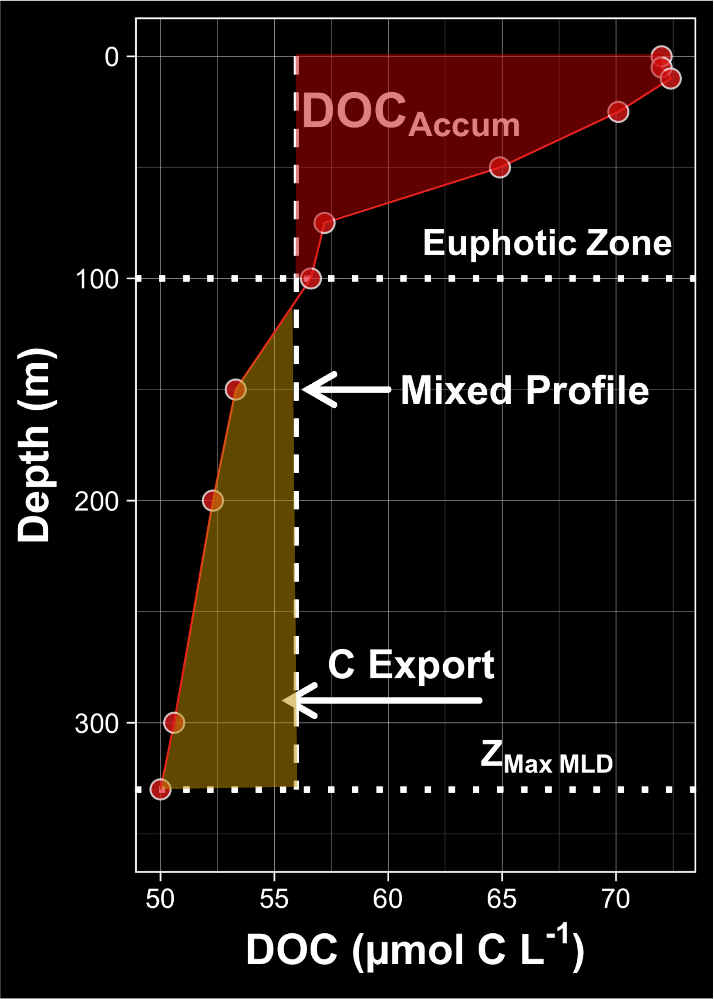
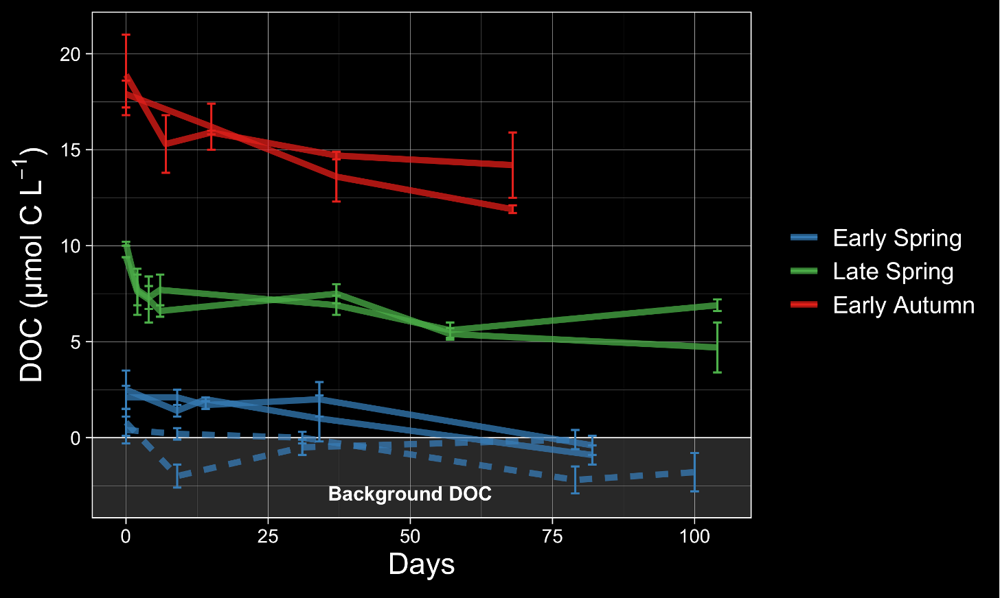
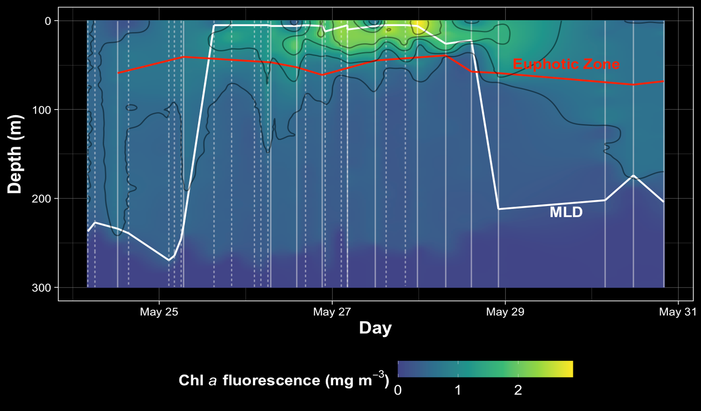

# North Atlantic Aerosols and Marine Ecosystems Study

The Northwest Atlantic Ocean is a region characterized by both massive seasonal phytoplankton blooms and deep convective overturning events that can physically deliver organic carbon produced by phytoplankton to depth, where it can be sequestered on the timescales of ocean circulaiton. The region is consequently important in regulating the flux of atmospheric CO~2~ into the ocean.

The NASA-funded [NAAMES](https://science.larc.nasa.gov/naames/) program was comprised of four field campaigns in the Northwest Atlantic involving coordinated ship, aircraft, remote sensing,  autonomous in situ sensing efforts. It was designed to resolve the dynamics and drivers of the annual phytoplankton bloom and their subsequent impacts on the atmosphere. The framework of NAAMES represented a great opportunity for us to track and assess the temporal and spatial dynamics of dissolved organic carbon (DOC), as well as the mechanisms that control its accumulation, persistence, and export. Our work on NAAMES was funded by the National Science Foundation and served as the focus of my dissertation, which is publicly available [here](https://www.proquest.com/docview/2596621124?pq-origsite=gscholar&fromopenview=true).

In this [paper](https://doi.org/10.3389/fmars.2020.00227), we combined autonomous float and ship-collected data to constrain the seasonal accumulation and export potential of DOC in the study region. 
\
\
```{r, echo=FALSE, fig.cap="Vertical profile of DOC from the surface to the annual maximum mixed layed depth (Z~MLD~). The red shaded area indicates the accumulation of DOC in the sunlit euphotic zone prior to deep mixing, while the yellow shaded area indicates the DOC exported into the mesopelagic upon deep mixing. The ability to estimate Z~MLD~ from ARGO floats allowed us to contextualize our discrete biogeochemical measurements and evaluate DOC export.", out.width = '50%', fig.align='center'}

```
\
\
In a follow up [paper](https://www.frontiersin.org/articles/10.3389/fmicb.2021.669883/abstract), we assess the interplay between seasonal bacterioplankton-phytoplankton carbon flux and DOC accumulation and bioavailability over the large latitudinal range occupied by NAAMES. 
\
\
```{r, echo=FALSE, fig.cap="DOC remineralization by heterotrophic bacteria over weeks to months assessed using seawater incubation experiments. These experiments provided and idea of how much DOC can escape microbial remineralization to potentially be exported and how that differs over seasons.", out.width = '75%', fig.align='center'}

```
\
\
In a third [paper](https://online.ucpress.edu/elementa/article/10/1/00078/190269/Bacterioplankton-response-to-physical), we described rare field observations of how microbes responded to organic matter redistribution following a deep mixing event.  
\
```{r, echo=FALSE, fig.cap="Storm-induced mixing and subsequent re-stratification of the water column. Data taken from this water mass revealed that the mixed layer extended to nearly 250 m, with deep water nutrients brought to the surface and organic matter exported to depth. This organic matter export likely fueled observed increases in heterotrophic biomass and activity.", out.width = '75%', fig.align='center'}

```

## Outreach and Media

We wrote notes from the field, published on [NASA’s Earth Observatory Blogs](https://earthobservatory.nasa.gov/blogs/fromthefield/category/naames/).

[Dr. James Allen](https://scholar.google.com/citations?user=XRYCd48AAAAJ&hl=en&oi=sra) and I were interviewed about the project on the podcast, [*Sisters of the Blue*](https://podcast.app/plankton-from-outer-space-e25700142/).

Dr. Carlson and I participated in an [Smithsonian initiative](https://ocean.si.edu/ocean-life/microbes
) led by [Dr. Alyson Santoro](https://santorolab.eemb.ucsb.edu), from which a short film by filmaker [Brendan Byrne](https://vimeo.com/brendansbyrne) was made:
\
\
<center><iframe src="https://player.vimeo.com/video/333852210?title=0&byline=0&portrait=0" width="640" height="360" frameborder="0" allow="autoplay; fullscreen" allowfullscreen></iframe>
<p><a href="https://vimeo.com/333852210">Marine Microbes Pt. I - Microbial World</a> from <a href="https://vimeo.com/brendansbyrne">Brendan Byrne</a> on <a href="https://vimeo.com">Vimeo</a>.</p></center>
\
[Nicole Estaphan](https://www.ksbw.com/news-team/a0dbf6cc-afdb-4b7f-bb98-7f50aab6249a), a journalist for WCVB-TV ABC Boston sailed with us on NAAMES and put together a story for the project:

<center><iframe width="560" height="315" src="https://www.youtube.com/embed/Fp3bNkXzbLI" frameborder="0" allow="accelerometer; autoplay; encrypted-media; gyroscope; picture-in-picture" allowfullscreen></iframe></center>
\
<center><iframe width="560" height="315" src="https://www.youtube.com/embed/YKbHJHfChSw" frameborder="0" allow="accelerometer; autoplay; encrypted-media; gyroscope; picture-in-picture" allowfullscreen></iframe></center>
\
<center><iframe width="560" height="315" src="https://www.youtube.com/embed/gUUoa9JgujE" frameborder="0" allow="accelerometer; autoplay; encrypted-media; gyroscope; picture-in-picture" allowfullscreen></iframe></center>
\
<center><iframe width="560" height="315" src="https://www.youtube.com/embed/O5QAg8L_xNM" frameborder="0" allow="accelerometer; autoplay; encrypted-media; gyroscope; picture-in-picture" allowfullscreen></iframe></center>

