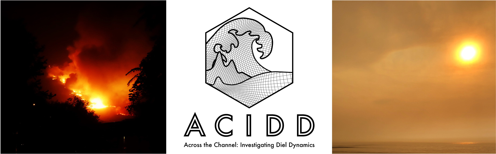

 

The oceans teem with marine microbes that move at the mercy of currents. All of these microbes are invisible to the naked eye, but have huge impacts on how food webs function and how elements are cycled throughout the planet! My research is dedicated to studying these amazing lifeforms and the processes they influence.

Below are themes that contextualize the research projects I am currently or have been involved with.

----

# **Optical Oceanography**

 

## Separating Phytoplankton from Zooplankton Backscatter

 

 
 
The daily vertical migration of zooplankton in the global oceans represents an important pathway by which carbon is shuttled from the sunlit surface to the deep dark ocean. While these vertical migrations can be detected in satellite retrievals of optical properties, specifically backscatter or backward scattered light, their signal can be obscured by the diel behaviors of phytoplankton. We are currently working on a NASA-funded project to tease apart the diel optical signatures associated with phytoplankton from those of vertical migrating zooplankton. To do so, we are evaluating changes in the optical properties and cell physiology of multiple ecologically-relevant phytoplankton species across a range of photoperiods and growth rates. 

----

# **Open Ocean Ecology and Biogeochemistry**

 

## North Atlantic Aerosols and Marine Ecosystems Study

 

 

The Northwest Atlantic Ocean is a region characterized by both massive seasonal phytoplankton blooms and deep convective overturning events that can physically deliver organic carbon produced by phytoplankton to depth, where it can be sequestered on the timescales of ocean circulaiton. The region is consequently important in regulating the flux of atmospheric CO~2~ into the ocean.  

The NASA-funded [NAAMES](https://naames.larc.nasa.gov) program was comprised of four field campaigns in the Northwest Atlantic involving coordinated ship, aircraft, remote sensing,  autonomous *in situ* sensing efforts. It was designed to resolve the dynamics and drivers of the annual phytoplankton bloom and their subsequent impacts on the atmosphere. The framework of NAAMES represented a great opportunity for us to track and assess the temporal and spatial dynamics of dissolved organic carbon (DOC), as well as the mechanisms that control its accumulation, persistence, and export. This work funded by the National Science Foundation, served as the focus of my dissertation, which is publicly available [here](https://www.proquest.com/docview/2596621124?pq-origsite=gscholar&fromopenview=true).

In this [paper](https://doi.org/10.3389/fmars.2020.00227), we combined autonomous float and ship-collected data to constrain the seasonal accumulation and export potential of DOC in the study region. In a follow up [paper](https://www.frontiersin.org/articles/10.3389/fmicb.2021.669883/abstract), we assess the interplay between seasonal bacterioplankton-phytoplankton carbon flux and DOC accumulation and bioavailability over the large latitudinal range occupied by NAAMES. We currently have a paper in revision that focuses on a rare opportunity during the May 2016 cruise where we document the epi- and meso-pelagic bacterioplankton response to the organic matter redistributed by deep mixing.  
 

### Media

We wrote notes from the field, published on [NASA’s Earth Observatory Blogs](https://earthobservatory.nasa.gov/blogs/fromthefield/category/naames/).

[Dr. James Allen](https://scholar.google.com/citations?user=XRYCd48AAAAJ&hl=en&oi=sra) and I were interviewed about the project on the podcast, [*Sisters of the Blue*](https://podcast.app/plankton-from-outer-space-e25700142/).

Dr. Carlson and I participated in an [Smithsonian initiative](https://ocean.si.edu/ocean-life/microbes
) led by [Dr. Alyson Santoro](https://santorolab.eemb.ucsb.edu), from which a short film by filmaker [Brendan Byrne](https://vimeo.com/brendansbyrne) was made:

<iframe src="https://player.vimeo.com/video/333852210?title=0&byline=0&portrait=0" width="640" height="360" frameborder="0" allow="autoplay; fullscreen" allowfullscreen></iframe>

<a href="https://vimeo.com/333852210">Marine Microbes Pt. I - Microbial World</a> from <a href="https://vimeo.com/brendansbyrne">Brendan Byrne</a> on <a href="https://vimeo.com">Vimeo</a>.

[Nicole Estaphan](https://www.ksbw.com/news-team/a0dbf6cc-afdb-4b7f-bb98-7f50aab6249a), a journalist for WCVB-TV ABC Boston sailed with us on NAAMES and put together a story for the project:

<iframe width="560" height="315" src="https://www.youtube.com/embed/Fp3bNkXzbLI" frameborder="0" allow="accelerometer; autoplay; encrypted-media; gyroscope; picture-in-picture" allowfullscreen></iframe>

<iframe width="560" height="315" src="https://www.youtube.com/embed/YKbHJHfChSw" frameborder="0" allow="accelerometer; autoplay; encrypted-media; gyroscope; picture-in-picture" allowfullscreen></iframe>

<iframe width="560" height="315" src="https://www.youtube.com/embed/gUUoa9JgujE" frameborder="0" allow="accelerometer; autoplay; encrypted-media; gyroscope; picture-in-picture" allowfullscreen></iframe>

<iframe width="560" height="315" src="https://www.youtube.com/embed/O5QAg8L_xNM" frameborder="0" allow="accelerometer; autoplay; encrypted-media; gyroscope; picture-in-picture" allowfullscreen></iframe>

 

## BIOS-SCOPE

 

Established in 2015 and funded by the Simons Foundation International, [BIOS-SCOPE](http://scope.bios.edu) is an ongoing research program focused on fieldwork in the vicinity of the Bermuda Atlantic Time-series Study ([BATS](http://bats.bios.edu)) site, one of the few locations in the global ocean with a long history of measurements. The program combines a wide array genomic, ecological, and oceanographic approaches to assess how microbes interact with each other and with chemical compounds to shape biogeochemical patterns. Much of my involvement with the program has been in support of the research by [Dr. Shuting Liu](https://scholar.google.com/citations?hl=en&user=e7KjxtMAAAAJ&view_op=list_works&sortby=pubdate), currently a postdoctoral scholar in Dr. Carlson's group. 

 

----

# **Microbial Responses to Environmental Perturbations**

 

## Across the Channel Investigating Diel Dynamics

 

ACIDD was a student-led oceanographic research cruise in which I was a co-PI and Chief Scientist that sought to document the daily rhythm of microbial processes in the Santa Barbara Channel (SBC). We secured ship time through the [UC Ship Funds](https://scripps.ucsd.edu/ships/uc-ship-funds-program) and over the course of a year, built a remarkable team that designed and planned achievable research objectives. When one of the California's largest recorded wildfire erupted days before our cruise, we were well prepared to respond quickly and take on a secondary objective: document and dissect the impacts of wildfire ash deposition on the marine ecosystems.

### Media

[Dr. Kelsey Bisson](https://scholar.google.com/citations?user=8FrNCE0AAAAJ&hl=en) led a project funded by the [National Academies Keck Futures Initiative](http://www.nasonline.org/programs/keck-futures-initiative/) that wove together the strengths of art and science. She put together a team of four artists, [Celia Jacobs](http://www.celiaj.com), [Dustin Hayes](http://lvl3official.com/walter-etc/), and [Gad Girling](https://gadgirling.myportfolio.com/projects), who worked to bring oceanography to the public eye through their mediums of art, music, photography, writing, and film. 
 
- See the magazine they produced [here](https://issuu.com/migrationsmag/docs/finalmigrationszinepages).
- Watch the video they produced below, which was featured at the 2019 [Environmental Film Festival](https://dceff.org/film/aquatic-cathartic/) in Washington, D.C.

<iframe src="https://player.vimeo.com/video/281882446" width="640" height="360" frameborder="0" allow="autoplay; fullscreen" allowfullscreen></iframe>

<a href="https://vimeo.com/281882446">Aquatic Cathartic</a> from <a href="https://vimeo.com/projectacidd">Project ACIDD</a> on <a href="https://vimeo.com">Vimeo</a>.

 

### Press

- [The Oceanography Society, 10/18](https://tos.org/pdfs/ocean_news_15.pdf)
- [Santa Barbara Independent, 2/18](https://www.independent.com/2018/02/12/thomas-fire-ash-sampled-santa-barbara-channel/)
- [Popular Science, 12/17](https://www.popsci.com/how-wildfire-impacts-ocean/?con=TrueAnthem&dom=fb&lnk=TA&src=SOC&utm_campaign&utm_content=5a3415d704d30137c1128bfb&utm_medium&utm_source)
- [Scripps News, 12/17](https://scripps.ucsd.edu/news/field-night-shift-santa-barbara-channel)
- [Daily Breeze, 12/17](https://www.dailybreeze.com/2017/12/26/are-southern-california-wildfires-a-threat-to-local-marine-life-a-new-study-aims-to-find-out/)
- [UC Santa Barbara The Current, 6/17](https://www.news.ucsb.edu/2017/018029/tuning-channel)

----

