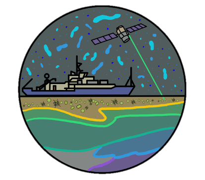

* <nicholasbaetge@gmail.com>
* [google scholar](https://scholar.google.com/citations?user=Ca8wN7sAAAAJ&hl=en) 
* [github](https://github.com/nbaetge)
* [twitter](https://twitter.com/nbaetge91)
* [download cv](https://github.com/nbaetge/nbaetge.github.io/raw/gh-pages/vitae.pdf)

----

**When you change the way you look at things, the things you look at change**

M. Planck

----

# **Who in the world am I?**

 

  

 

Someone who thinks on the run and runs to think. Though sometimes I run to escape thinking. I dig in and focus on the task at hand. I focus on trying to run faster, harder, smarter, and better. But I try to respect my limits because I'm only human. I also try to remember to have fun; else, what's the point? 

This running mentality transcends to other aspects of me, increasingly the part of me that is a scientist. Not being shy to new challenges and  wanting to have fun, but also having an amazing support network and some luck have all helped get me to where I am today.

During my time as a graduate student, I learned from and worked with [Dr. Craig Carlson and his lab](https://labs.eemb.ucsb.edu/carlson/craig/), exploring the incessently fascinating world of marine microbes (read as: bacteria) and how they shape (and are shaped by) ocean biogeochemistry (read as: carbon cycling). 

I am currently a postdoctoral scholar with [Dr. Michael Behrenfeld](https://bpp.oregonstate.edu/users/michael-behrenfeld) and [Dr. Kim Halsey](http://kim.halsey.co), with whom I will work to tease apart the diel optical signatures associated with phytoplankton from those of vertical migrating zooplankton. 

Poke around to learn more about my research and **please, don't hesitate to contact me!** 

----

###### This website was last updated `r format(Sys.Date(), '%B %d, %Y')`

