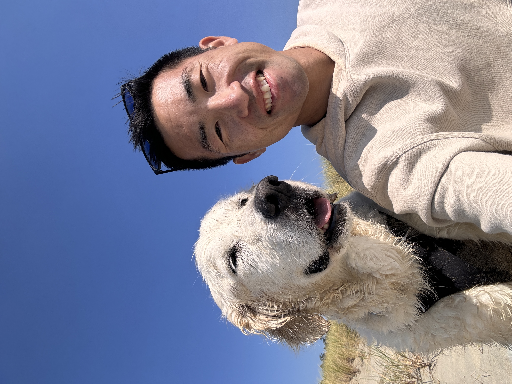

<h1 style="margin-bottom:5px;">Nick Baetge, Ph.D.</h1>
<h2 style="margin-top:5px; margin-bottom:5px;">NSF OCE Postdoctoral Research Fellow</h2>
<h3 style="margin-top:5px; margin-bottom:5px;">Oregon State University</h3>

\
```{r, echo=FALSE, fig.cap= "", out.width = '40%', fig.align='center'}

```
\
I am a biological oceanographer who studies microorganisms to understand their role in cycling carbon and energy through ocean ecosystems.

I am currently working with [Dr. Kimberly Halsey](https://kim.halsey.co) and [Dr. Michael Beherenfeld](https://sites.science.oregonstate.edu/ocean.productivity/) at Oregon State University as well as [Dr. Erin Hanan](https://erinhanan.com) at the University of Nevada, Reno as a National Science Foundation Ocean Science Postdoctoral Fellow focused on the impacts of wildfire ash deposition on ocean biology.
\
\
<center>{ width=60% }
\
\
<h4 style="font-size: 14px; color: #AEC96F"> "Plankton from the Oregon Coast in July 2023, shot with the Curiosity Microscope."Being a scientist and sailor is too good to be true." - Roger Revelle; a short reel from a 5 day research cruise off Hawaii. </h4></center>
\
My doctoral work was guided by [Dr. Craig Carlson](https://carlson.eemb.ucsb.edu) at UC Santa Barbara and sought to clarify the magnitude and divers of surface dissolved organic carbon (DOC) accumulation over the course of the annual phytoplankton bloom in the North Atlantic, the contribution of DOC to annual vertical carbon export via deep convective mixing, and the fate of surface accumulated DOC following physical export.

Since completing my doctoral work, I've gained expertise in bio-optical oceanography and the calibration and validation of satellite remote sensing data. At Oregon State University, I have been working to characterize and link diel changes in phytoplankton optical properties and cell physiology. 
\
\
```{r, echo=FALSE, fig.cap= "", out.width = '80%', fig.align='center'}
knitr::include_graphics("images/sally_ride_lab.jpg")
```
----

###### This website was last updated `r format(Sys.Date(), '%B %d, %Y')`. If there is anything you find on this website that is inaccurate or needs updating or if there are resources that would be helpful to include, please don’t hesitate to let me know!

