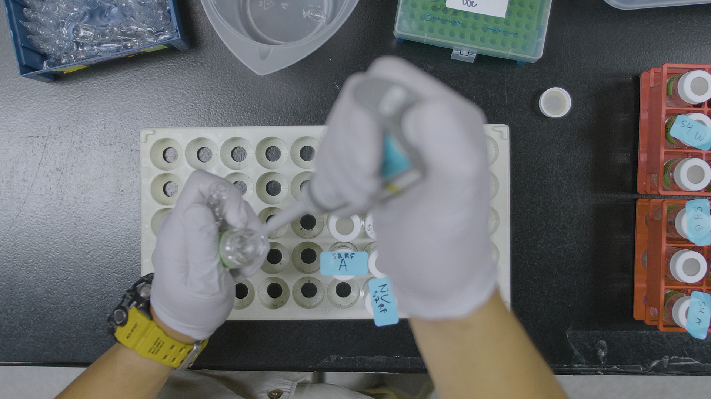

----

**The tedium makes her ecstatic. She calls it he science paradox. It's the most brain crushing work a person can do, yet it can spring the mind enough to see what else but the mind is really out there** 

R. Powers in _Overstory_

----

## **North Atlantic Aerosols and Marine Ecosystems Study (NAAMES)**

 

<left></left>  

 

### DOC Accumulation and Export

  

Published [here](https://doi.org/10.3389/fmars.2020.00227)

Check out the poster [here](https://osm2020-agu.ipostersessions.com/default.aspx?s=EE-EA-F8-F3-B2-2A-99-45-3A-4C-A8-8A-60-42-E7-56)

 

### Bacterial Carbon Demand and DOC Bioavailability

  

 

### Microbial Response to Stratification 

  

 
 

## **Across the Channel Investigating Diel Dynamics (ACIDD)**

 

<left></left>  

 

Check out the overview [here](https://doi.org/10.5670/oceanog.2020.110)

### Microbial Response to Ash Deposition

----

**This page is under construction**